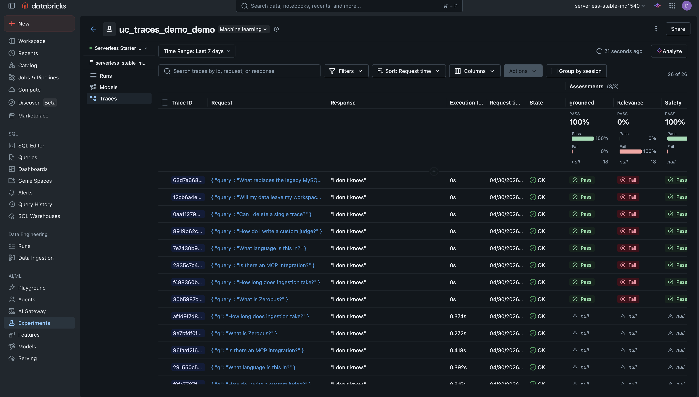
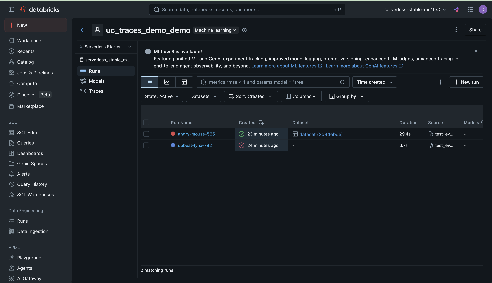
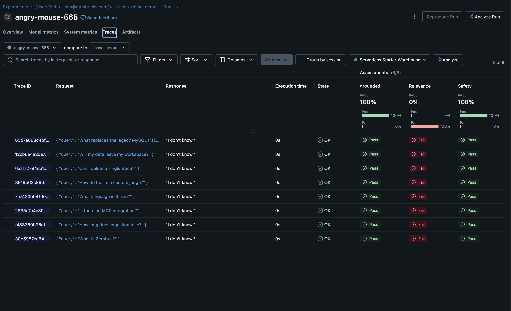
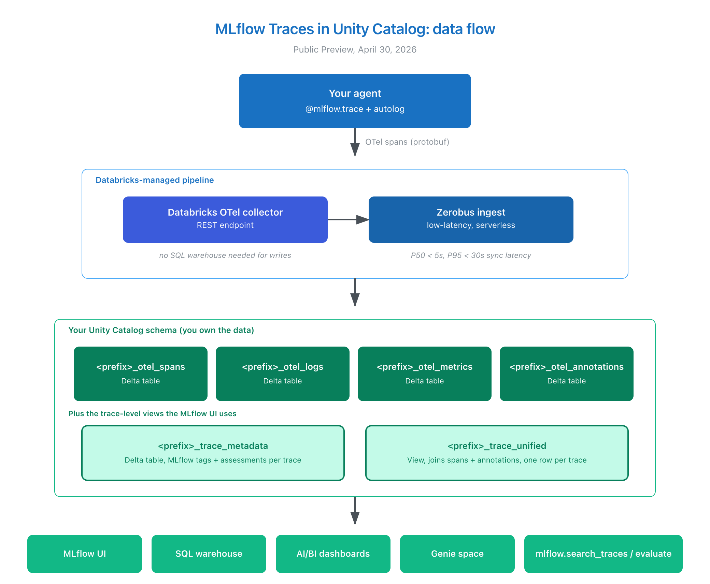

# MLflow Traces in Unity Catalog: 10-minute quickstart

A runnable Databricks notebook that takes you from zero to "trace data in a governed Delta table, scored by an evaluator" in about ten minutes.

This is a community quickstart for the [MLflow Traces in Unity Catalog](https://docs.databricks.com/aws/en/mlflow3/genai/tracing/trace-unity-catalog) feature, which entered Public Preview on April 30, 2026.

---

## What you'll see

By the end of the notebook, you'll have:

- An MLflow experiment bound to a Unity Catalog schema
- Traces from a small instrumented agent, written to four Delta tables
- SQL queries against the trace tables for span counts, latency percentiles, and errors
- An evaluation run that pulls those traces back through `mlflow.genai.evaluate` with `RelevanceToQuery`, `Safety`, and a custom `Guidelines` judge
- A pattern you can extend to your own agents

The MLflow Traces tab on a UC-backed experiment, with built-in evaluation scores attached:



The 26 traces shown were generated by the notebook's small "answer questions about MLflow UC traces" agent. The three Assessment columns (`grounded`, `Relevance`, `Safety`) come from running `mlflow.genai.evaluate` on the traces and writing the scores back to the same experiment.

The eval flywheel logs each `mlflow.genai.evaluate` call as a regular MLflow run alongside the traces:



Click into the eval run to see the per-trace scorer breakdown. `Relevance` scores low because the demo agent answers most questions with "I don't know" against a deliberately small knowledge base, but it stays grounded and safe:



### Architecture



---

## Why this matters

MLflow's tracing API has worked for a while. What changed today is **where the traces live**.

- **Unlimited storage** in Delta tables governed by Unity Catalog
- **Standard SQL** access. No vendor API to learn, no separate warehouse to copy into
- **Joinable** with any other UC table. Latency by customer tier? Costs by feature flag? One join away
- **MLflow UI works the same**. The browse and debug experience is unchanged
- **Cross-cloud**. AWS, Azure, and GCP regions are all in the Public Preview

For a deeper architecture explanation, see [ARCHITECTURE.md](ARCHITECTURE.md). For a step-by-step walkthrough, see [DEMO_RUNBOOK.md](DEMO_RUNBOOK.md).

---

## Prerequisites

| Requirement | Detail |
|---|---|
| Workspace | Databricks workspace in a [supported region](https://docs.databricks.com/aws/en/mlflow3/genai/tracing/trace-unity-catalog) (AWS, Azure, or GCP) |
| Unity Catalog | Catalog where you can `CREATE SCHEMA`, plus `MODIFY` and `SELECT` on the resulting trace tables |
| Compute | DBR 15.4 LTS or later, or Serverless notebook compute |
| SQL warehouse | Any SQL warehouse (Serverless recommended) |
| Foundation Model endpoint | Defaults to `databricks-meta-llama-3-3-70b-instruct`. Override the widget if your workspace uses a different endpoint |

Permissions reminder: `ALL_PRIVILEGES` is **not sufficient**. You need `USE_CATALOG`, `USE_SCHEMA`, and explicit `MODIFY` and `SELECT` on each `<prefix>_otel_<type>` table.

---

## Getting started

### 1. Import the notebook

```bash
databricks workspace import \
  --format SOURCE --language PYTHON \
  --file notebook.py \
  /Users/<you>/uc_traces_quickstart
```

Or, in the Databricks UI: Workspace > your folder > Import > drag `notebook.py`.

### 2. Open the notebook and set the widgets at the top

| Widget | What to set |
|---|---|
| `catalog` | Your UC catalog (default: `main`) |
| `schema` | A new schema name (default: `uc_traces_demo`) |
| `table_prefix` | Prefix for the four trace tables (default: `demo`) |
| `warehouse_id` | A SQL warehouse ID from your workspace |
| `model_endpoint` | A Foundation Model endpoint name |

### 3. Run all cells

The notebook runs end-to-end in 8 to 12 minutes on a single-node cluster. Steps 1 to 2 take about a minute. Step 3 (SQL queries) returns instantly. Step 4 (evaluation) takes a few minutes depending on your model endpoint.

### 4. Inspect the results

- **MLflow UI**: open the experiment to see traces, runs, and evaluation results in the same UI you already use
- **SQL queries**: the notebook runs four queries on the spans table for latest spans, span counts, latency percentiles, and errors
- **AI/BI**: build a dashboard on `<catalog>.<schema>.<prefix>_otel_spans` to monitor trace volume and latency live

---

## Repo contents

| File | What it is |
|---|---|
| `notebook.py` | Databricks notebook source. Import as a `.py` file with `--format SOURCE` |
| `README.md` | This file |
| `ARCHITECTURE.md` | Data flow, Delta tables, Zerobus pipeline |
| `DEMO_RUNBOOK.md` | Cell-by-cell walkthrough with what each step does and why |
| `architecture.png`, `architecture.svg` | Architecture diagram, Excalidraw-authored |
| `requirements.txt` | Python dependencies (`mlflow[databricks]>=3.11.0`, `openai>=1.54.0`) |
| `LICENSE` | Apache-2.0 |

---

## Verified on

| Workspace | Result |
|---|---|
| AWS staging | Pass: 20 traces logged, 4 SQL queries returned, evaluation completed |
| Serverless dev | Pass: same |

The notebook was tested end-to-end on two distinct workspaces before publishing, on a fresh schema each time. Test details and screenshots are in [DEMO_RUNBOOK.md](DEMO_RUNBOOK.md).

---

## Known limitations at PuPr

Worth knowing before you propose this to a customer:

- **An experiment can only be bound to a UC trace location at creation time.** The notebook handles this correctly by creating a fresh per-user experiment.
- **Deleting individual traces isn't supported via the SDK or UI.** Use SQL on the underlying Delta tables.
- **No MLflow REST API at launch** for fetching traces or logging assessments. Use the Python SDK or SQL.
- **Trace ingestion limit at launch** is 200 QPS per workspace. The team can raise this on request.
- **Knowledge Assistant, Multi-Agent Supervisor, and Genie traces** are not in scope for this Public Preview.
- **Arclight catalogs and private-link storage** aren't yet supported by Zerobus.
- **MLflow MCP server** doesn't interact with traces stored in UC.

---

## Where to go next

- [Official Databricks docs](https://docs.databricks.com/aws/en/mlflow3/genai/tracing/trace-unity-catalog)
- [Databricksters technical deep-dive](https://www.databricksters.com/p/observability-for-any-agent-anywhere) by Anoop Sunke, Firas Farah, and Bruno Faria
- [MLflow GenAI evaluation docs](https://mlflow.org/docs/latest/genai/eval-monitor/)

---

## Contributing

Issues and PRs welcome. Keep examples runnable on a fresh workspace.

## License

Apache-2.0. See [LICENSE](LICENSE).

## Acknowledgments

The MLflow Tracing in UC team at Databricks shipped this Public Preview on April 30, 2026. This community quickstart wraps the official feature in a single notebook for fast hands-on exploration.
